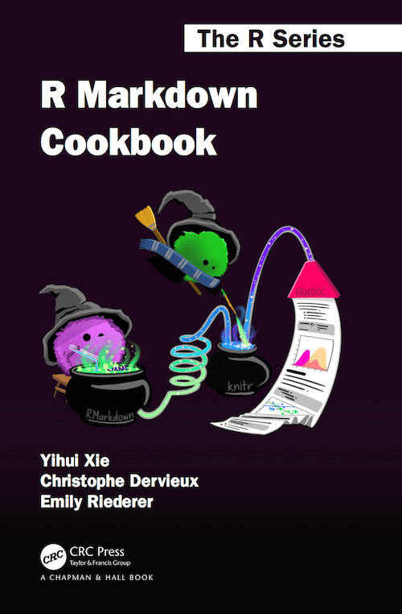

```{r setup, include = FALSE}
library(knitr)
library(tidyverse)
library(kableExtra)
# Opciones por defecto
opts_chunk$set(fig.width = 7.252, fig.height = 4, dpi = 300,
               fig.retina=3, warning = FALSE, message = FALSE)
# Xaringan settings
xaringanExtra::use_tile_view() # xaringan-tile-view
xaringanthemer::style_solarized_light(title_slide_background_color = "#ffffff",
                                      title_slide_text_color = "#5f00db", # purple
                                      inverse_header_color="#fdf6e3",
                                      text_color = "#6d7173",
                                      background_color = "#ffffff",
                                      header_color ="#5f00db",
                                      link_color = "#15b2db", # skyblue
                                      text_bold_color = "#f72585", # pink
                                      inverse_text_color = "#d3d3d3",
                                      inverse_background_color ="#112121")
xaringanExtra::use_webcam() #Webcam
xaringanExtra::use_panelset() # xaringan-panelset,
xaringanExtra::use_fit_screen() # xaringan-fit-screen
xaringanExtra::use_clipboard() #clipboard
xaringanExtra::use_extra_styles(hover_code_line = TRUE, mute_unhighlighted_code = FALSE)
```

class: title-slide
background-image: url(figs/bannerAUFPAS2.png)
background-position: 11% 10%
background-size: 500px

# <span style = 'font-size: 100%;'>¿Qué puedo hacer con R y RStudio?</span>
### <span style = 'color: #4a4a4a; font-size: 120%'>Ventajas de aprender a programar</span>
<br>
### <span style = 'font-size: 90%;color:#4a4a4a'>Blgo. Irwing S. Saldaña</span>

### <span style = 'font-size: 70%;color:#15b2db'>Instituto de Ciencias Antonio Brack</span>
### <span style = 'font-size: 70%;color:#aaa59f'>Dpto. Ecoinformática y Biogeografía</span>


---
class: inverse, middle, center 
background-image: url(https://source.unsplash.com/jqgsM3B9Fpo)
background-size: cover
background-position: top

```{r, fig.align='center', out.width="25%", echo=FALSE}
include_graphics("figs/aboutme.png")
```

### Blgo. Irwing S. Saldaña <br><span style= 'font-size:80%; font-weigth: light;'> Instructor</span>
<span style= 'font-family: calibri; color: white'>Departamento de Ecoinformática y Biogeografía,<br>
Instituto de Ciencias Antonio Brack, Perú</span>

.white[[Website](https://www.brackinstitute.com/)|[ResearchGate](https://www.researchgate.net/profile/Irwing-Saldana)|[Linkedin](https://www.linkedin.com/in/irssald/)|[R Blog](https://www.brackinstitute.com/rlatinoamerica) ]

---
class: inverse, middle, center , animated, slideInRight
name: GLM

# La camino de R<br>
[ Por qué aprender un lenguaje de programación ]

---
# RStudio

--

- R: Lenguaje de programación para **análisis estadístico y graficación**.

--

- Gran **comunidad** de desarrollo.

--

```{r}
# Cargando la lista de paquetes de CRAN
paquetes <- available.packages() |> as.data.frame() 
length(paquetes$Package) #<<
```

--

- **RStudio es un intérprete de R** que permite tener una experiencia más sencilla al trabajar con código.

---

class: inverse, middle, center , animated, slideInRight
name: GLM

# Flexibilidad de análisis <br>
[ Gracias a una de las comunidades más grandes del mundo ]


---

# Flexibilidad de análisis 

- Miles de funciones para realizar análisis diversos.

- Librerías especializadas para especialidades específicas.

- Capacidad de ajustar los parámetros a nivel avanzado.

- Pasar de un análisis a otro es sencillo.

- Flujo de trabajo ¡Eureka! fácil de seguir.


```{r, eval=FALSE}
library(tidyverse)
data("airquality")
names(airquality)
lm(Temp ~ Ozone, data=airquality) |> summary()
plot(Temp ~ Ozone, data=airquality)
```

Veamos qué podemos hacer en RStudio.


---

class: inverse, middle, center , animated, slideInRight
name: GLM

# Gramática de Gráficos con ggplot2 <br>
[ La mejor herramienta de graficación estadística ]

---

# Salve ggplot2

--

- **gg** proviene de Gramática de Gráficos

--

- La mejor librería de graficación por su flexibilidad.

--

- Decenas de librerías asociadas a ggplot2 que simplifican la graficación aún más.  


---
# GGally

.panelset[
.panel[.panel-name[Gráfico]

```{r, echo=F, out.width="65%", fig.align='center',dev.args = list(bg = 'transparent'), fig.retina=4}
library(GGally)
data(iris)
p <- ggpairs(iris, aes(color = Species), upper = list(continuous = wrap("cor", size = 3)))+ theme_bw()
for(i in 1:p$nrow) {
  for(j in 1:p$ncol){
    p[i,j] <- p[i,j] + 
      scale_fill_manual(values=c("#15b2db","#5f00db","#f72585")) +
      scale_color_manual(values=c("#15b2db","#5f00db","#f72585"))  
  }
}
p

```

]

.panel[.panel-name[Código]
```{r, eval=F}
# install.packages("GGally")
library(GGally)
p <- ggpairs(iris, aes(color = Species), upper = list(continuous = wrap("cor", size = 2)))+
  theme_bw()

for(i in 1:p$nrow) {
  for(j in 1:p$ncol){
    p[i,j] <- p[i,j] + 
      scale_fill_manual(values=c("#15b2db","#5f00db","#f72585")) +
      scale_color_manual(values=c("#15b2db","#5f00db","#f72585"))  
  }
}

p
```

]
]

---

# ggpubr

.panelset[
.panel[.panel-name[Gráfico]
```{r, echo=F, out.width="65%", fig.align='center',dev.args = list(bg = 'transparent'), fig.retina=4}
library(ggpubr)
data("ToothGrowth")
df <- ToothGrowth
p <- ggboxplot(df, x = "dose", y = "len",
                color = "dose", palette =c("#15b2db","#5f00db","#f72585"),
                add = "jitter", shape = "dose")
my_comparisons <- list( c("0.5", "1"), c("1", "2"), c("0.5", "2") )
p + stat_compare_means(comparisons = my_comparisons)+
  stat_compare_means(label.y = 50)  
```

]

.panel[.panel-name[Código]
```{r, eval=F}
#install.packages("ggpubr")
library(ggpubr)
data("ToothGrowth")
df <- ToothGrowth
p <- ggboxplot(df, x = "dose", y = "len",
                color = "dose", palette =c("#15b2db","#5f00db","#f72585"),
                add = "jitter", shape = "dose")
my_comparisons <- list( c("0.5", "1"), c("1", "2"), c("0.5", "2") )
p + stat_compare_means(comparisons = my_comparisons)+
  stat_compare_means(label.y = 50)  
```

]
]

---

# ggridges

.panelset[
.panel[.panel-name[Gráfico]
```{r, echo=F, out.width="65%", fig.align='center',dev.args = list(bg = 'transparent'), fig.retina=4}
library(ggridges)
data("iris")
ggplot(iris, aes(x = Petal.Length, y = Species, fill = 0.5 - abs(0.5 - stat(ecdf)))) +
  stat_density_ridges(geom = "density_ridges_gradient", calc_ecdf = TRUE) +
  scale_fill_gradient2(low="#f72585", mid="#15b2db", high = "#5f00db", 
                       guide = "colourbar", name = "ECDF - Probabilidad")+
  theme_classic2()
```

]

.panel[.panel-name[Código]
```{r, eval=F}
#install.packages("ggridges")
library(ggridges)
data("iris")
ggplot(iris, aes(x = Petal.Length, y = Species, fill = 0.5 - abs(0.5 - stat(ecdf)))) +
  stat_density_ridges(geom = "density_ridges_gradient", calc_ecdf = TRUE) +
  scale_fill_gradient2(low="#f72585", mid="#15b2db", high = "#5f00db", 
                       guide = "colourbar", name = "ECDF - Probabilidad")+
  theme_classic2()
```

]
]

---

# ggradar

.panelset[
.panel[.panel-name[Gráfico]
```{r, echo=F, out.width="65%", fig.align='center',dev.args = list(bg = 'transparent'), fig.retina=4}
library(ggradar)
library(tidyverse)
library(scales)

mtcars_radar <- mtcars %>% 
  as_tibble(rownames = "group") %>% 
  mutate_at(vars(-group), rescale) %>% 
  tail(4) %>% 
  select(1:10)

ggradar(mtcars_radar)+
  theme(legend.position = "none")+
  scale_color_manual(values = c("#15b2db","#17004a","#5f00db","#b5179e","#f72585"))
```

]

.panel[.panel-name[Código]
```{r, eval=F}
#devtools::install_github("ricardo-bion/ggradar", dependencies = TRUE)
library(ggradar)
library(tidyverse)
library(scales)

mtcars_radar <- mtcars %>% 
  as_tibble(rownames = "group") %>% 
  mutate_at(vars(-group), rescale) %>% 
  tail(4) %>% 
  select(1:10)

ggradar(mtcars_radar)+
  theme(legend.position = "none")+
  scale_color_manual(values = c("#15b2db","#17004a","#5f00db","#b5179e","#f72585"))
```

]
]

---

# Y la lista sigue y sigue...

- ggcorrplot
- ggstatsplot
- Plotly
- ggthemes
- gganimate
- patchwork
- ggmap
- ggrepel
- ggdendro
- sjPlot
- ggvegan
- ggforce
- ggupset


---

- Veamos la aplicación con el modelo creado hace un momento

```{r echo=F, fig.align='center', out.width="70%",dev.args = list(bg = 'transparent'), fig.retina=4}

```

---

# Libro Visualización de Datos con R
```{r, echo=F}
knitr::include_url("https://rkabacoff.github.io/datavis/Models.html")
```

---
class: inverse, middle, center , animated, slideInRight
name: GLM

# Proyectos en RStudio <br>
[ Lo mejor para lidiar con varios proyectos a la vez ]

---

# Proyectos en RStudio

--

- Permiten tener todo organizado.

--

- Facilita la carga de archivos a RStudio.

--

- Facilita el trabajo con diferentes proyectos a la vez.

---
background-image: url(figs/project.png)
background-size: contain
background-color: #ebebeb

---
class: inverse, middle, center , animated, slideInRight
name: GLM
 
# Las mejoras de RStudio<br>
[ Actualización version 1.4.1717 ]


---

# RStudio cada vez mejor

--

.pull-left[

- Última versión 1.4.1717. [Descargar](https://download1.rstudio.org/desktop/windows/RStudio-1.4.1717.exe)

- **Mejoras:** Paréntesis de arcoíris (Rainbow Parenthesis)

```{r, echo=F, out.width="100%"}

```
]

--

.pull-right[

```{r, echo=F, out.width="80%"}
knitr::include_graphics("figs/rainbow.png")
```
]

---

- **Mejoras:** Editor Visual de RMarkdown (Visual Editor)

--

```{r, echo=F, out.width="100%", fig.align='center'}

```


---

- **Mejoras de R implementada en el último RStudio:** Pipe nativo |>

```{r}
data(airquality)

# El nuevo Pipe Nativo
#airquality |> mutate(tiempo = as.character(paste0(Month,"-",Day)) ggplot(aes(x=))

# El Pipe (original) de Tidyverse


```


---
class: inverse, middle, center , animated, slideInRight
name: GLM

# RMarkdown <br>
[ Reportes, Papers y Páginas Web ]

---

.pull-left[
```{r, echo=F, out.width="70%"}

```
]

.pull-right[

.pull-left[
```{r, echo=F, out.width="60%"}

```

```{r, echo=F, out.width="55%"}

```

<br>
<br>
<br>
- [Link lectura libro (o vean la siguiente diapositiva)](https://bookdown.org/yihui/rmarkdown-cookbook/)

]

.pull-rigth[
```{r, echo=F, out.width="30%"}

```
<br>
<br>
<br>
### rticle

]
]


---

# Libro de Cocina de RMarkdown
```{r, echo=F}
knitr::include_url("https://bookdown.org/yihui/rmarkdown-cookbook/")
```


---

# [rticle](https://github.com/rstudio/rticles#readme): la librería de las plantillas de Journals


```{r, echo=F, out.width="90%", fig.align='center'}

```


---
class: inverse, middle, center , animated, slideInRight
name: GLM

# Github <br>
[ Crear páginas web y repositorios ]

---

# Páginas web gratuitas con GitHub

.content-box-red[**Utilizando RMarkdown**], usando el lenguaje de R con un poco de conocimientos en estructura YAML, y, si uno desea, algo de HTML y CSS con [Remark JS](https://remarkjs.com/#1), y una pizca de LaTeX para las funciones matemáticas. [URL RLab](https://irwingss.github.io/IrwingRLab/PractCasa04-full.html)

```{r, echo=F, out.width="60%", fig.align='center', fig.}

```

---
class: inverse, middle, center , animated, slideInRight
name: GLM

# Xaringan <br>
[ Crea un Genjutsu con tus Diapositivas ]


---

# Gráficos de alta calidad en tus diapositivas

.panelset[
.panel[.panel-name[Código R]

```{r, eval=F}
library(tidyverse)
data(iris)
iris %>% mutate(Species = factor(Species, #<<
                          labels = c("setosa"="I. setosa", #<<
                                     "versicolor"="I. versicolor", #<<
                                     "virginica"="I. virginica"))) %>%  #<<
  ggplot(aes(x=Sepal.Length, y=Petal.Length, color= Species))+
  geom_point(size=4, alpha=0.7)+
  labs(x="Longitud de Sépalo (mm)", y="Longitud de Pétalo (mm)", 
       color="Especies",
       title = "Gráfico Bivariado (Dispersión de Puntos)", 
       subtitle="Para graficar la relación de dos variables")+
  theme_minimal()+
  scale_color_manual(values = c("#15b2db","#5f00db","#f72585"))+
theme(legend.position = "bottom",
      legend.text = element_text(face=3))
```

]

.panel[.panel-name[Figura 1.1]
```{r echo=F, fig.align='center', out.width="65%"}
library(tidyverse)
data(iris)
iris %>% mutate(Species = factor(Species,
                          labels = c("setosa"="I. setosa",
                                     "versicolor"="I. versicolor",
                                     "virginica"="I. virginica"))) %>% 
  ggplot(aes(x=Sepal.Length, y=Petal.Length, color= Species))+
  geom_point(size=4, alpha=0.7)+
  labs(x="Longitud de Sépalo (mm)", y="Longitud de Pétalo (mm)", 
       color="Especies",
       title = "Gráfico Bivariado (Dispersión de Puntos)", 
       subtitle="Para graficar la relación de dos variables")+
  theme_minimal()+
  scale_color_manual(values = c("#15b2db","#5f00db","#f72585"))+
theme(legend.position = "bottom",
      legend.text = element_text(face=3))
```
]
]

---

```{r echo=F, fig.align='center', out.width="100%",dev.args = list(bg = 'transparent'), fig.retina=4}
library(tidyverse)
data(iris)
iris %>% mutate(Species = factor(Species,
                          labels = c("setosa"="I. setosa",
                                     "versicolor"="I. versicolor",
                                     "virginica"="I. virginica"))) %>% 
  ggplot(aes(x=Sepal.Length, y=Petal.Length, color= Species))+
  geom_point(size=4, alpha=0.7)+
  labs(x="Longitud de Sépalo (mm)", y="Longitud de Pétalo (mm)", 
       color="Especies")+
  theme_minimal()+
  scale_color_manual(values = c("#15b2db","#5f00db","#f72585"))+
 theme(legend.position = "bottom",
      legend.text = element_text(face=3),
      panel.background = element_rect(fill = "transparent"),
      plot.background = element_rect(fill = "transparent", colour = NA),
      panel.grid.major = element_blank(),
    panel.grid.minor = element_blank(),
    text = element_text(size=10))
```

---

# Resultados interactivos en tus  [diapositivas](https://garthtarr.github.io/sydney_xaringan/#12)

.scroll-box-18[
```{r}
data(iris)
lm(Petal.Length ~ Species, data = iris) |> summary() #<<
```
]

